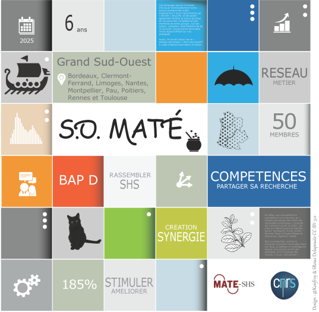

```{=html}
<div class="mosaique">

  <div class="tuile tuile-edition">
    <p class="chiffre">7</p>
    <p class="mention">èmes journées<br>annuelles<br>SO-MATé</p>
  </div>

  <div class="tuile tuile-theme">
    <span class="eyebrow">Thème</span>
    <h1>Le coût caché du libre et de l'open science</h1>
  </div>

  <div class="tuile tuile-affiche">
    
  </div>

  <div class="tuile tuile-info">
    <span class="eyebrow">Dates</span>
    <p class="valeur">5 et 6 novembre 2026</p>
  </div>

  <div class="tuile tuile-info">
    <span class="eyebrow">Lieu</span>
    <p class="valeur">IEP Bordeaux</p>
  </div>

  <a class="tuile tuile-action" href="inscription.html">
    <span class="eyebrow">Participer</span>
    <span class="valeur">S'inscrire</span>
  </a>

  <div class="tuile tuile-aplat" aria-hidden="true"></div>

</div>
```

7èmes journées annuelles du réseau SO-MATé qui auront pour thème
**« le coût caché du libre et de l'open science »**.

## Le thème

Le libre et l'open science sont gratuits pour celui qui les consomme... jamais pour
celui qui les produit ou les maintient. Ces journées proposent de rendre visibles
les coûts que les discours d'ouverture laissent souvent dans l'ombre : temps de création, et de production, la maintenance des outils, la montée en compétences, la dette technique, la  charge de documentation, la dépendance à des communautés bénévoles, les effets de report sur les métiers de support à la recherche, etc.

::: {.callout-note title="Meta verse..."}
Pour initier ces journée dés à présent une petite ironie mérite d'être dite franchement ! Pour des journées intitulées « le coût caché du libre et de l'open science », le site est hébergé sur une plateforme propriétaire appartenant à Microsoft...
:::

## Le réseau SO-MATé

SO-MATé est la déclinaison Grand Sud-Ouest du réseau métier
[MATE-SHS](https://mate-shs.cnrs.fr/){target="_blank"} (Méthodes, Analyses, Terrains, Enquêtes en sciences humaines et sociales). Il rassemble une cinquantaine de membres à
Bordeaux, Brest, Clermont-Ferrand, Limoges, Nantes, Montpellier, Pau, Poitiers, Rennes
et Toulouse, autour d'un objectif simple : partager des pratiques de recherche
et échanger sur nos métiers.
